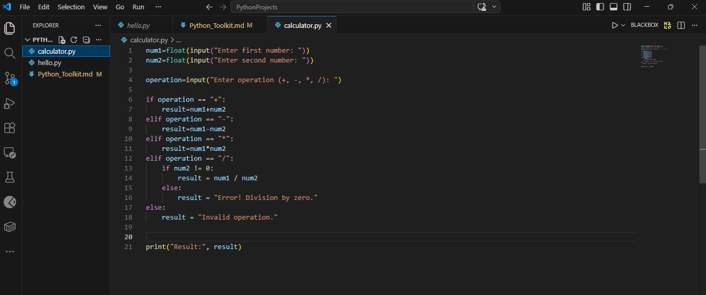
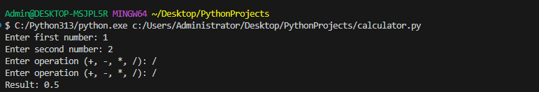
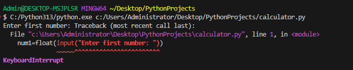

## Title & Objective

## Technology
python

## Why python?
"I choose Python because it has a simple and readable syntax, which allows me to focus on solving problems rather than getting lost in complex code. It's incredibly versatile, with applications in web development, data analysis, and automation. Plus, the extensive libraries and frameworks available make it easy to implement powerful solutions quickly. The strong community support ensures that I can always find help and resources when needed. Overall, Python not only meets my current needs but also opens up many opportunities for future projects."

## End goal
Build a simple Python calculator to demonstrate.
- Variables
- User input/output
- Basic arithmetic operations
- Conditional logic

## Quick Summary of Python
Python is a high-level programming language that emphasizes readability and simplicity. Its extensive libraries and strong community support further enhance its appeal across various fields.As  It allows developers to write programs quickly and clearly.

## Where is it used?
- Web development (backend for websites)
- Automation (scripts to automate tasks)
- AI and data science
- Apps and games

## Real-World Examples

- **Google**: Uses Python for backend services, AI, and search engine components.

# System Requirements

## Operating System
- Windows 10 or later
- MacOS 10.15 or later
- Linux (Ubuntu 20.04 or later)

## Tools / Editors
- **VS Code**: code editor
- **Python IDLE**: Built-in Python editor for running scripts

## Python Version
- Python 3.13.12

## Required Packages
- No additional packages needed for this beginner project

- **Git (optional)**: For version control if uploading to GitHub


# Minimal Working Example


## Python Beginner Toolkit
# Description
This is a simple Python calculator that allows the user to input two numbers and choose an operation (+, -, *, /). The program then performs the calculation and displays the result.
This project is a beginner-friendly Python toolkit that demonstrates basic programming concepts such as variables, input/output, and conditional logic using a simple calculator.

## How to Run

1. Install Python
2. Run:
   python calculator.py

## Code


# Screenshot


# output



```python
# Simple calculator in Python

num1 = float(input("Enter first number: "))
num2 = float(input("Enter second number: "))

operation = input("Enter operation (+, -, *, /): ")

if operation == "+":
    result = num1 + num2
elif operation == "-":
    result = num1 - num2
elif operation == "*":
    result = num1 * num2
elif operation == "/":
    if num2 != 0:
        result = num1 / num2
    else:
        result = "Error! Division by zero."
else:
    result = "Invalid operation."

print("Result:", result)

Admin@DESKTOP-MSJPL5R MINGW64 ~/Desktop/PythonProjects
 C:/Python313/python.exe c:/Users/Administrator/Desktop/PythonProjects/calculator.py
Enter first number: 1
Enter second number: 2
Enter operation (+, -, *, /): /
Enter operation (+, -, *, /): /
Result: 0.5


# AI Prompt Journal

## Prompt 1

**Prompt Used:**  
Explain Python variables in a simple way for beginners

**Link to Curriculum:**  
https://ai.moringaschool.com/

**Relevant AI Response:**  
"Variables are containers used to store data such as numbers or text. For example, name = 'Afline' stores the value 'Afline' in a variable."

**Evaluation:**  
This response was very helpful because it simplified the concept of variables and made it easy to understand and apply in my code.

---

## Prompt 2

**Prompt Used:**  
How do I take user input in Python?

**Link to Curriculum:**  
https://ai.moringaschool.com/

**Relevant AI Response:**  
"The input() function is used to collect data from the user. For example, name = input('Enter your name: ') allows the user to type a value."

**Evaluation:**  
This helped me understand how to interact with users in my program and was easy to test immediately in VS Code.

---

## Prompt 3

**Prompt Used:**  
Create a simple Python calculator program using beginner concepts

**Link to Curriculum:**  
https://ai.moringaschool.com/

**Relevant AI Response:**  
"The program uses input(), variables, and conditional statements (if/elif/else) to perform arithmetic operations like addition and division."

**Evaluation:**  
This was very useful because it helped me combine multiple concepts into one working project, which became my minimal working example.

---

## Prompt 4

**Prompt Used:**  
How do I fix division by zero error in Python?

**Link to Curriculum:**  
https://ai.moringaschool.com/

**Relevant AI Response:**  
"You can prevent this error by checking if the denominator is zero before performing division using an if statement."

**Evaluation:**  
This improved my program by making it more reliable and helped me understand basic error handling.

---

## Reflection

Using AI tools helped me learn Python faster by providing instant explanations and examples. It improved my understanding of concepts and helped me debug errors efficiently. AI acted as a learning assistant throughout the project.

# Error

## Screenshot


**What happened:**  
The program skipped directly to:
"Enter operation..." without asking for numbers.

**Cause:**  
This was caused by incorrect execution flow or accidental input errors.

**Solution:**  
I reran the program and entered inputs in the correct order:
1. First number  
2. Second number  
3. Operation  

---

## References for Fixes

https://stackoverflow.com/questions/18938891/simple-calculator-in-c-flow-of-input-skipping-over-scanf

# References

- W3Schools Python Tutorial: https://www.w3schools.com/python/
- Python Official Documentation: https://docs.python.org/3/
- VS Code Official Website: https://code.visualstudio.com/
- Moringa AI Platform: https://ai.moringaschool.com/
- Stack Overflow: https://stackoverflow.com/
https://campus.datacamp.com/courses/intro-to-python-for-data-science/chapter-1-python-basics?ex=1&skip_variants_modal=true